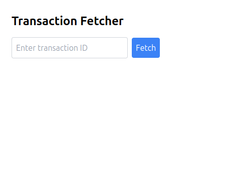
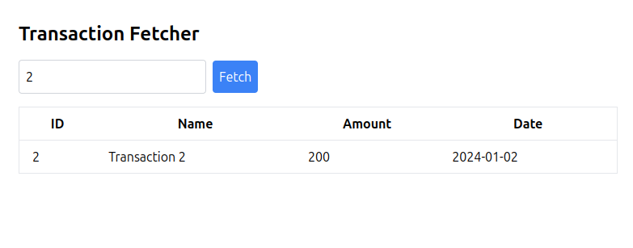
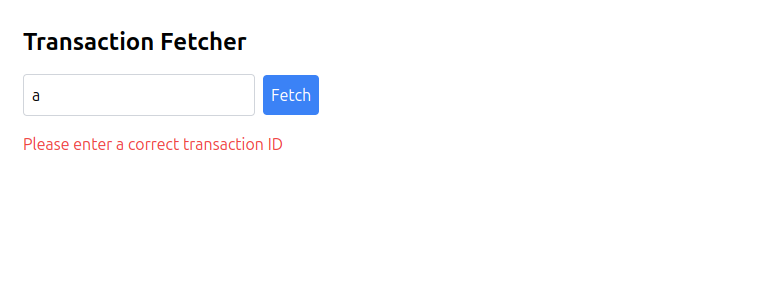

# Transaction Fetcher

A simple React application that fetches and displays transaction data based on the transaction ID entered by the user. This project uses TailwindCSS for styling.

## Features

- Fetch transaction data based on the transaction ID.
- Display data in a tabular format.
- Show error messages for invalid or non-existent transaction IDs.

## Demo

Live link: [Transaction Fetcher Live](https://zingy-fairy-d5fba1.netlify.app/)

## Screenshots

### Initial Page


### Page with Table
 
### Error Case - Invalid ID



### Error Case - Non-existent ID
 

## Installation

   ```bash
   git clone git@github.com:sxhil296/Transaction_Fetcher.git
   cd transaction-fetcher
   npm install
   npm run dev
   ```
